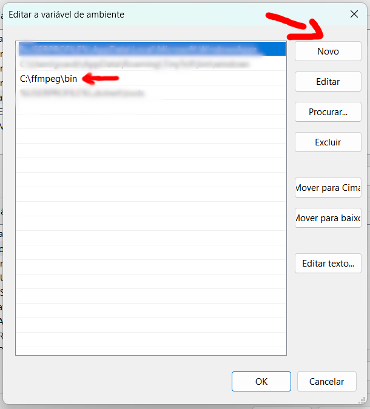

FFmpeg é uma ferramenta de software de código aberto amplamente utilizada para processamento e conversão de áudio e vídeo.

Para instalar no Windows, são necessários alguns passos:

1. Download da biblioteca FFmpeg

* Acesse o site [ffmpeg.org](https://ffmpeg.org/) e procure o link para Download na plataforma Windows

* Procure os arquivos disponíveis em `Windows builds from gyan.dev`
  * link direto: [www.gyan.dev/ffmpeg/builds](https://www.gyan.dev/ffmpeg/builds/)
  
* Faça o donwload do arquivo `ffmpeg-git-full.7z`
  * link direto: [www.gyan.dev/ffmpeg/builds/ffmpeg-git-full.7z](https://www.gyan.dev/ffmpeg/builds/ffmpeg-git-full.7z)

2. Extrair o arquivo compactado

* Extraia o conteúdo do arquivo compactado para o diretório raiz C:\
  * Se necessário, instale o descompactador `7zip` disponível em  [www.7-zip.org/download](https://www.7-zip.org/download.html)

* Renomeie a pasta para um nome mais simples, apenas `ffmpeg`. O resultado vai ficar como na figura abaixo.

3. Adicionar a pasta `C:\ffmpeg\bin` ao PATH do Windows

* Na caixa de pesquisa do Windows digite `Editar as Variáveis de Ambiente do Sistema`
  * Veja na figura abaixo com fazer.
  
  
  
  * Clique em abrir
  
* Na janela recém aberta, clique em *Variáveis de Ambiente*

* Na seção de Variáveis de usuário, selecione *Path* e clique em *Editar...*
 

* Clique em *Novo*, adicione o caminho `C:\ffmpeg\bin` e clique em OK para confirmar.

4. Testar se a instalação foi bem-sucedida:

* Abra o Terminal do Windowa digitando *terminal* na caixa de pesquisa do Windows.

* No terminal, digite `ffmpeg -version`

* se for exibido algo como na imagem abaixo, a instalação foi executada com sucesso!

