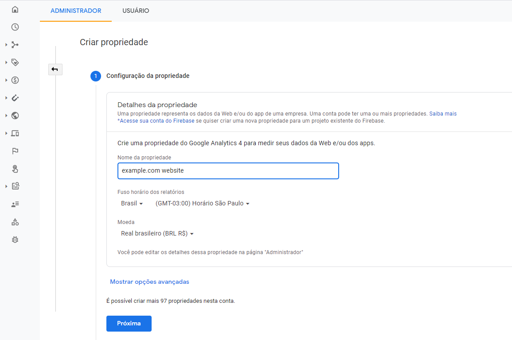
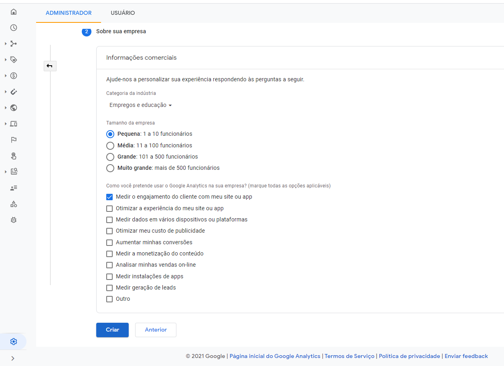
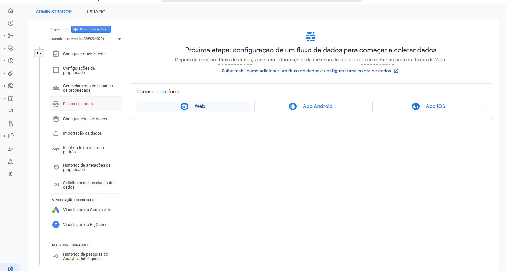
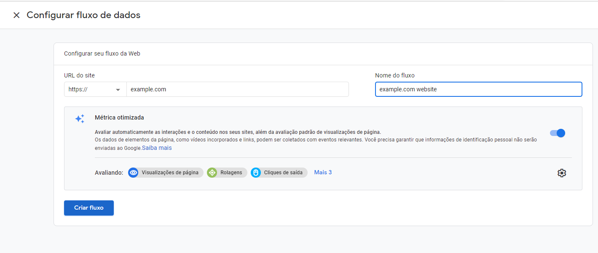
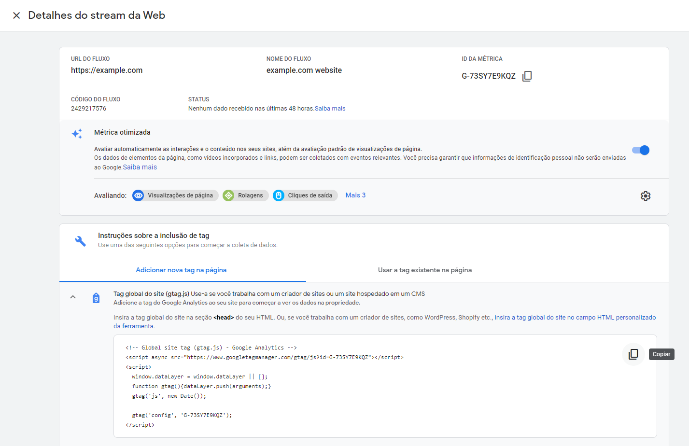

O Google Analytics é uma ferramenta que monitora o tráfego de qualquer site e pode ser utilizado em seu e-book publicado com o pacote *bookdown*.

Inicialmente, você deve criar uma conta no [Google Analytics](https://analytics.google.com/).

Em seguida, deve criar uma propriedade:





e um fluxo de dados:







Mais informações [aqui: support.google.com/analytics](https://support.google.com/analytics)

O que precisamos é da *Tag global do site (gtag.js)* que será inserida na seção <head> do HTML do nosso site. O código deste exemplo está apresentado na figura acima e será parecido com este código abaixo:

```html
<!-- Global site tag (gtag.js) - Google Analytics -->
<script async src="https://www.googletagmanager.com/gtag/js?id=G-73SY7E9KQZ"></script>
<script>
  window.dataLayer = window.dataLayer || [];
  function gtag(){dataLayer.push(arguments);}
  gtag('js', new Date());

  gtag('config', 'G-73SY7E9KQZ');
</script>
```

Na raiz do seu projeto bookdown, você deve criar um arquivo HTML contendo este código, por exemplo, `GA.html`.

Este arquivo deve incluído em `_output.yml` da seguinte forma:

```YAML
bookdown::gitbook: 
  includes:
    in_header: GA.html
```
Muito cuidado com a indentação, pois caso a estrutura estiver desalinhada, o código pode não funcionar adequadamente. 

Após finalizado, acesse sua conta no [Google Analytics](https://analytics.google.com/) para verificar se o monitoramento já está funcionando. 