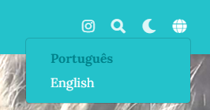

## Publicando conteúdo em vários idiomas?

Eu considero muito importante a comunicação de forma escrita. Sempre consumo muito material da forma escrita e aprendo melhor lendo do que assistindo ou ouvindo. Por isso, a importância de manter um blog com textos.

Mas para ampliar o alcance da audiência, é importante também publicar o conteúdo em inglês. Utilizando as ferramentas deste tema (Wowchemy Academic), é possível manter o conteúdo em dois (ou mais) idiomas.

Toda postagem pode ser escrita primeiramente em sua língua nativa (no meu caso, o português) e, depois de traduzida, publicada em paralelo.

